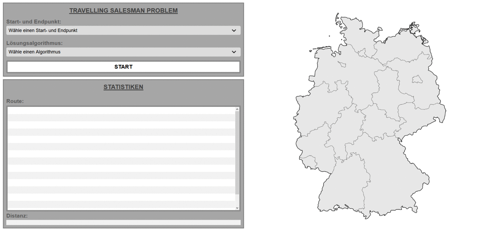

# Travelling-Salesman-Problem
Die Umsetzung des Travelling Salesman Problems mit JavaScript.

Es soll ermöglicht werden eine der 16 Bundeslandshauptstädte als Start- und Endpunkt auzuwählen, dann soll einer der beiden Algorithmen zum lösen des Travelling Salesman Problem ausgewählt werden.
Wenn alles ausgewählt wurde, soll der Start-Knopf betätigt werden und dem Nutzer soll der kürzeste Weg durch alle 16 Bundeslandhauptstädte in der Deutschlandkarte eingezeichnet werden, in einer Tabelle soll die Route verschriftlicht werden und es soll die zurückgelegte Distanz ausgegeben werden.

